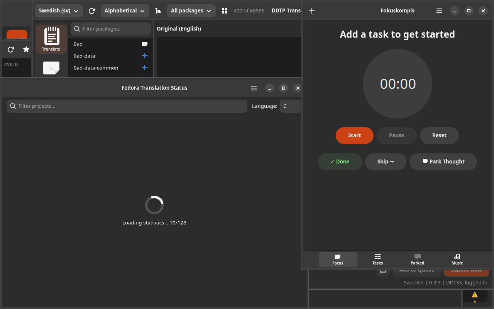

# Fokuskompis

Focus and task manager for people with ADHD and autism.

Built with GTK4/Adwaita. Part of the [Danne L10n Suite](https://github.com/yeager/debian-repo).

## Installation

### Debian/Ubuntu
```bash
sudo apt install fokuskompis
```

### Fedora/RPM
```bash
sudo dnf install fokuskompis
```

## License

GPL-3.0

## Author

Daniel Nylander — [danielnylander.se](https://danielnylander.se)

## Screenshots



