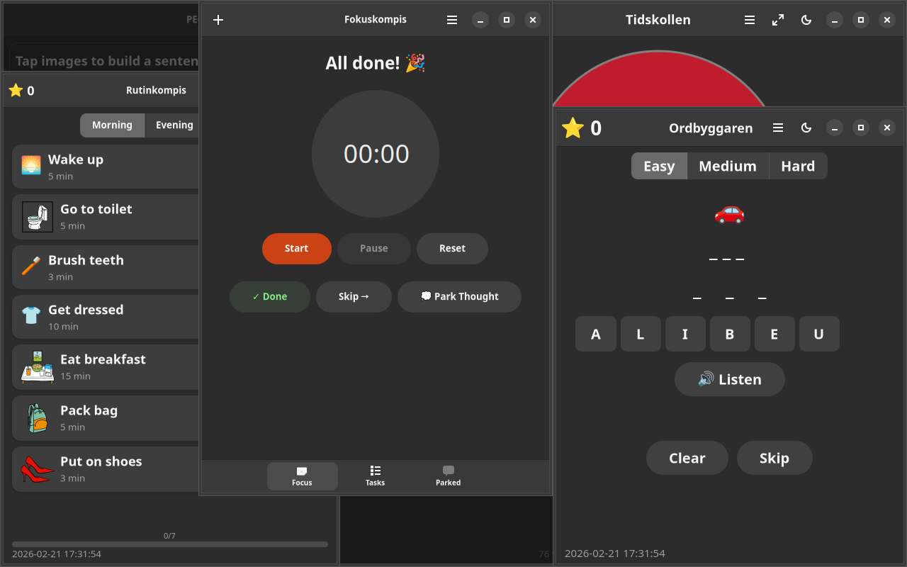
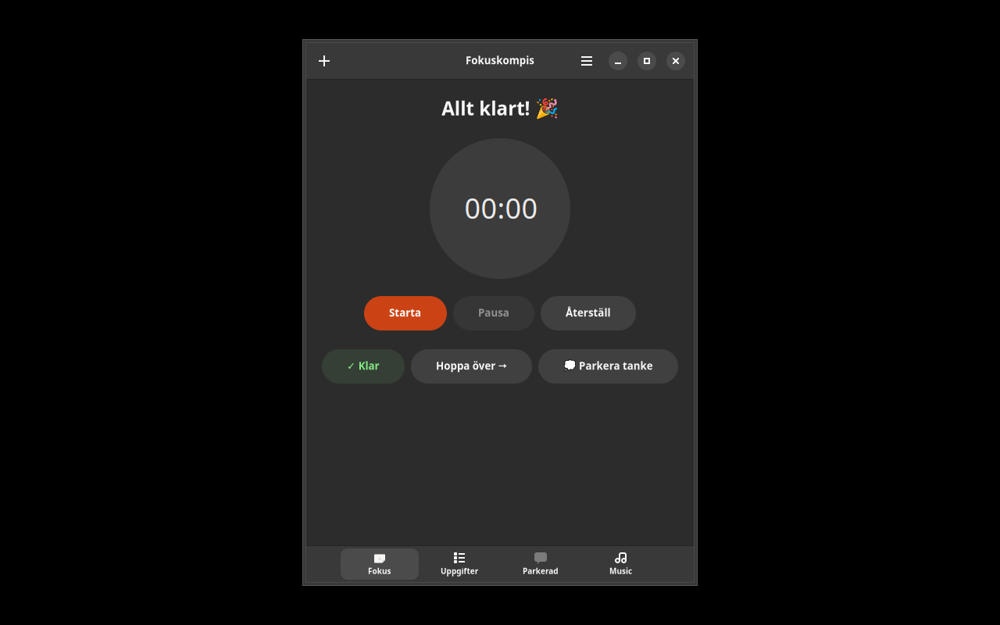

# Fokuskompis


## Screenshots

| English | Svenska |
|---------|---------|
|  |  |

Focus & task manager for people with ADHD and autism.

## Features

- **Single-task focus** — one task at a time, big and clear
- **Pomodoro timer** — configurable work/break intervals with visual countdown
- **Step breakdown** — split big tasks into smaller steps
- **Park thoughts** — capture distracting thoughts without losing focus
- **Visual rewards** — stars on task completion
- **TTS alerts** — Piper (neural) or espeak-ng voice notifications

## Install

### Debian/Ubuntu
```bash
sudo apt install fokuskompis
```

### Fedora
```bash
sudo dnf install fokuskompis
```

## License

GPL-3.0-or-later
